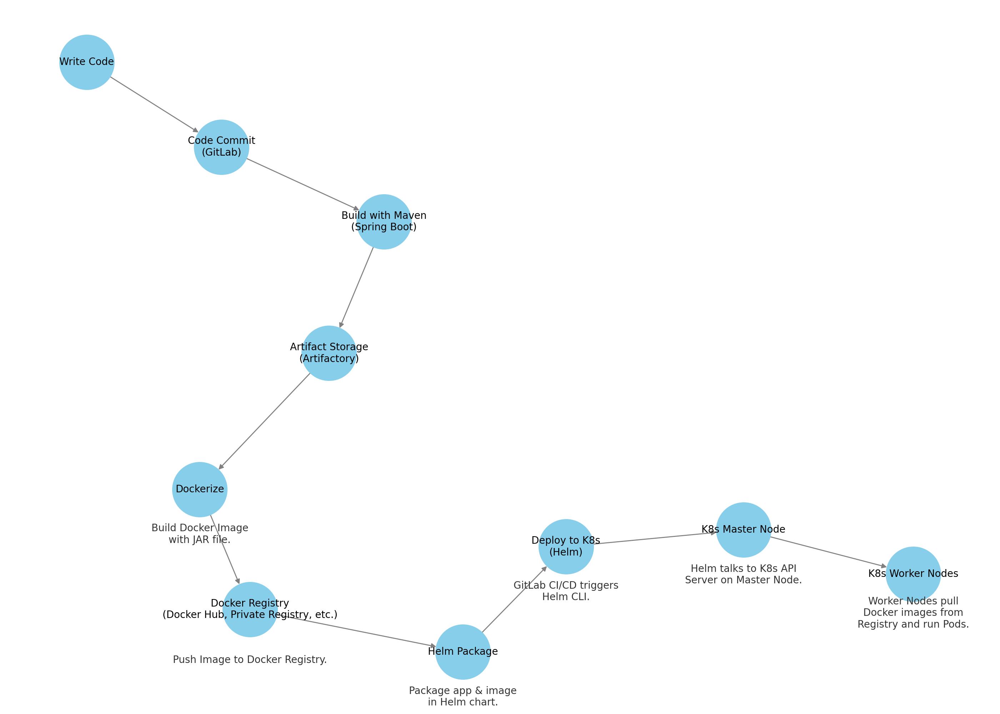

# Complete CI/CD Guide with Spring Boot, Maven, Artifactory, Docker, Helm, and Kubernetes

This guide will walk you through each step of a CI/CD pipeline, involving Maven, Spring Boot, Artifactory, Docker, Helm, and Kubernetes.

## Table of Contents
1. [Spring Boot Application with Maven](#spring-boot-application-with-maven)
2. [Build with Maven](#build-with-maven)
3. [Artifact Storage (Artifactory)](#artifact-storage-artifactory)
4. [Dockerize](#dockerize)
5. [Docker Registry](#docker-registry)
6. [Helm Package](#helm-package)
7. [Deploy to Kubernetes](#deploy-to-kubernetes)
8. [CI/CD Pipeline in GitLab](#cicd-pipeline-in-gitlab)
9. [Understanding the Flow](#understanding-the-flow)

---

## Spring Boot Application with Maven

To start, you need to create a simple Spring Boot application. You can set this up easily using [Spring Initializr](https://start.spring.io/), or you can manually create a Maven project and add a `pom.xml` file for dependencies.

Here's a basic `pom.xml` example:

```xml
... (XML content here)
```

And your Spring Boot application (`Application.java`) could look something like this:

```java
... (Java code here)
```

---

## Build with Maven

Once your application is set up, you can build it using Maven. Open a terminal, navigate to your project directory, and run:

```bash
mvn clean install
```

This will produce a JAR file in the `target/` directory.

---

## Artifact Storage (Artifactory)

After building the application, the next step is to store the generated JAR file. You can use Artifactory for this:

```bash
curl -u"username:password" -T target/simple-app-1.0-SNAPSHOT.jar "http://your-artifactory-instance.com/artifactory/libs-release-local/com/example/simple-app/1.0-SNAPSHOT/simple-app-1.0-SNAPSHOT.jar"
```

---

## Dockerize

Now you'll create a Docker image of your application. Create a `Dockerfile` in your project directory:

```Dockerfile
... (Dockerfile content here)
```

To build the Docker image, run:

```bash
docker build -t simple-app:1.0 .
```

---

## Docker Registry

After building the Docker image, you can push it to a Docker registry like Docker Hub:

```bash
docker push username/simple-app:1.0
```

---

## Helm Package

Next, you can package your application and Docker image into a Helm chart. Create a `values.yaml` file:

```yaml
... (YAML content here)
```

Create a Helm `Deployment.yaml`:

```yaml
... (YAML content here)
```

To package the Helm chart, run:

```bash
helm package simple-app
```

---

## Deploy to Kubernetes

To deploy the Helm chart to a Kubernetes cluster, run:

```bash
helm install simple-app ./simple-app-1.0.tgz
```

---

## CI/CD Pipeline in GitLab

To automate all the above steps, you can set up a CI/CD pipeline in GitLab. Create a `.gitlab-ci.yml` file in your project directory:

```yaml
... (YAML content here)
```

---

## Understanding the Flow

Here's how all these components interact:

- **Docker builds and stores the image**: You have the option of pushing it to a remote registry.
- **Helm packages your Kubernetes configurations**: Among these configurations is the specification of which Docker image to use.
- **Kubernetes, orchestrated by Helm, pulls the image from the specified registry** when it needs to run a new pod.



---

For more details and advanced configurations, you can refer to the official documentation for each tool.

